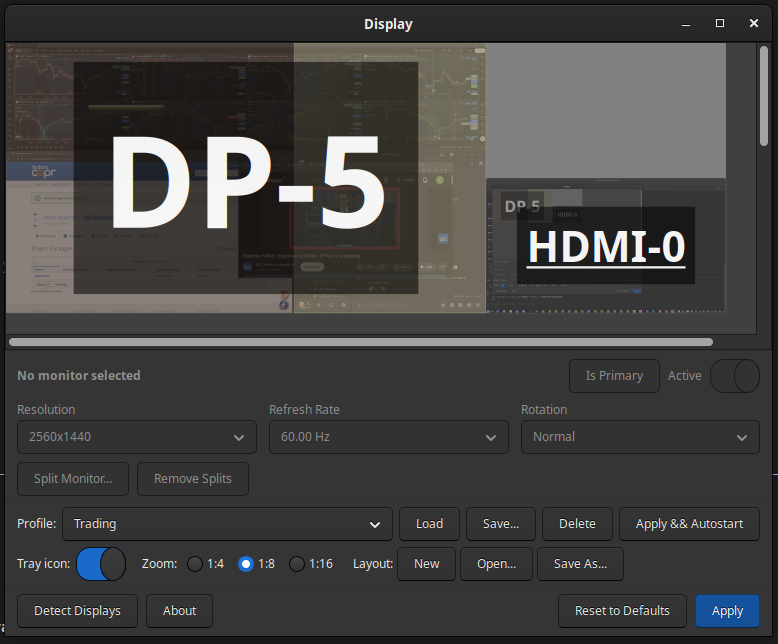
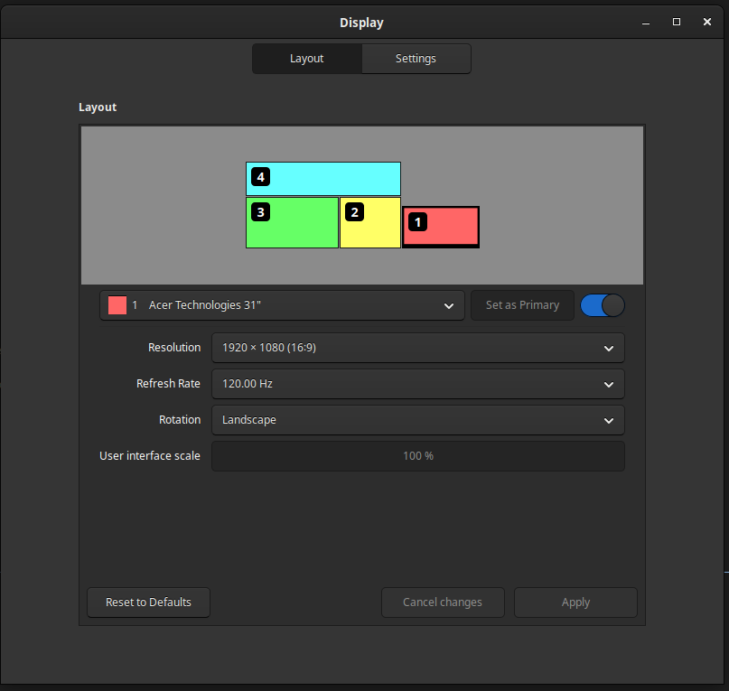

# SplitRandR

A GTK3 display layout editor for X11 that lets you split a single physical monitor into multiple virtual monitors for window tiling and maximization. Based on [ARandR](https://christian.amsuess.com/tools/arandr/).

SplitRandR is focused on **Linux Mint / Cinnamon** desktops, where the Muffin window manager ignores RandR 1.5 virtual monitors. It bundles a vendored fork of [fakexrandr](https://github.com/niclas/fakexrandr) to work around this by intercepting libXrandr calls at the LD_PRELOAD level.





**This is experimental software.** It is unlikely to work on your system without some tweaking. It was developed against a specific hardware setup (Samsung Odyssey Ark + Acer HDMI monitor on Cinnamon 6.x / Fedora) and the workarounds are tailored to that environment.

## What it does

- Provides a graphical editor for multi-monitor layouts (inherited from ARandR)
- Adds the ability to **split any output into sub-regions** using a drag-to-split interface
- Generates `xrandr --setmonitor` commands for the virtual monitor geometry
- Bundles a modified fakexrandr library that presents those splits as real outputs/CRTCs to window managers
- Handles Cinnamon-specific crash workarounds (SIGSTOP/SIGCONT during setmonitor calls)
- Writes `cinnamon-monitors.xml` so display settings (positions, modes, primary) survive Cinnamon restarts
- Supports profiles, autostart scripts, and a system tray icon

## Why Cinnamon?

Most X11 window managers use the **RandR 1.2/1.3 CRTC/Output model** to determine monitor boundaries for window maximization and tiling. RandR 1.5 introduced virtual Monitors (`xrandr --setmonitor`), which exist at the X server level but are ignored by most window managers — Muffin (Cinnamon), Mutter (GNOME), KWin (KDE), and others all disregard them.

This means `xrandr --setmonitor` alone does **not** make your window manager respect virtual splits. The windows will still maximize to the full physical output.

To solve this, SplitRandR uses **fakexrandr**, an LD_PRELOAD library that intercepts `XRRGetScreenResources()` and related calls. When a window manager calls these functions, fakexrandr intercepts them and returns fake outputs and CRTCs for each split region. The WM thinks they are real monitors.

The Cinnamon focus exists because:

1. **Muffin >= 5.4.0 segfaults** when it receives RandR SetMonitor events ([muffin#532](https://github.com/linuxmint/muffin/issues/532)). SplitRandR includes a `CinnamonSetMonitorGuard` that SIGSTOPs Cinnamon during `--setmonitor` calls and disables the `csd-xrandr` settings daemon plugin to prevent it from fighting our changes.

2. **Muffin uses both libXrandr and libxcb-randr**. The fakexrandr library intercepts libXrandr calls via LD_PRELOAD, but Muffin also makes direct xcb-randr calls that bypass the interception. The vendored fakexrandr includes additional xcb-randr interceptors for `set_crtc_config`, `set_crtc_transform`, and `change_output_property` to handle this.

3. **Cinnamon's display persistence** uses `~/.config/cinnamon-monitors.xml`. When Cinnamon restarts, it reads this file to restore display settings. SplitRandR writes this file with correct entries for both the split layout (fake output connectors like `DP-5~1`, `DP-5~2`) and the unsplit layout, so settings survive restarts.

Other desktop environments have their own quirks and would need their own workarounds. The approach taken here is in principle applicable to GNOME, KDE, etc., but the crash workarounds, config file format, and xcb interception details would differ.

## How it works

### Architecture

```
SplitRandR (Python/GTK3)
├── gui.py          - Main application window
├── widget.py       - Monitor preview/layout widget (from ARandR)
├── xrandr.py       - XRandR wrapper with --setmonitor support
├── splits.py       - Binary split tree model (proportional 0.0-1.0)
├── cinnamon_compat.py - SIGSTOP/SIGCONT guard for Muffin crash
├── fakexrandr_config.py - Binary config writer + monitors.xml writer
├── profiles.py     - Named profile management
└── tray.py         - System tray icon

fakexrandr/ (vendored C library)
└── libXrandr.c     - LD_PRELOAD interception of libXrandr + libxcb-randr
```

### Split tree model

Splits are stored as a binary tree with proportional positions:

```
Root (V split at 60%)
├── Left leaf  (60% width)
└── Right (H split at 40%)
    ├── Top leaf (40% height of right portion)
    └── Bottom leaf
```

Each split has a direction (`H` for horizontal line, `V` for vertical line) and a proportion (0.0-1.0). This makes splits resolution-independent — they scale with the output.

### Apply flow

When you click **Apply**:

1. `xrandr --output ... --mode ... --pos ...` sets the physical output configuration
2. Inside a `CinnamonSetMonitorGuard` (SIGSTOPs Cinnamon):
   - Existing virtual monitors (`OUTPUT~N`) are deleted
   - New virtual monitors are created via `xrandr --setmonitor`
   - The fakexrandr binary config (`~/.config/fakexrandr.bin`) is written
3. `cinnamon-monitors.xml` is written with correct positions/modes for all outputs
4. If Cinnamon doesn't have fakexrandr loaded (checked via `/proc/PID/maps`):
   - Cinnamon is restarted with `LD_PRELOAD=.../libXrandr.so.2 cinnamon --replace`
   - After settling, the xrandr config and setmonitor commands are re-applied
   - The fakexrandr binary config is re-written

### fakexrandr binary config format

The config file (`~/.config/fakexrandr.bin`) is a sequence of entries:

```
Entry:
  <length:       4 bytes, uint32>     Total length of payload
  <output_name:  128 bytes, padded>   e.g. "DP-5"
  <edid:         768 bytes, padded>   Hex-encoded EDID string
  <width:        4 bytes, uint32>     Output width in pixels
  <height:       4 bytes, uint32>     Output height in pixels
  <split_count:  4 bytes, uint32>     Number of leaf regions
  <tree_data:    variable>            Serialized binary tree

Tree node:
  'N'                                 Leaf node
  'H' + <pos: 4 bytes, uint32>       Horizontal split at pos pixels from top
       + left_tree + right_tree
  'V' + <pos: 4 bytes, uint32>       Vertical split at pos pixels from left
       + left_tree + right_tree
```

### fakexrandr interception

The vendored fakexrandr intercepts at two levels:

**libXrandr level** (standard LD_PRELOAD):
- `XRRGetScreenResources` / `XRRGetScreenResourcesCurrent` — augmented with fake outputs, CRTCs, and modes
- `XRRGetOutputInfo` — returns fake output info for split regions
- `XRRGetCrtcInfo` — returns fake CRTC info with correct geometry
- `XRRSetCrtcConfig` — no-op for fake CRTCs (updates internal state)
- `XRRGetOutputProperty` — returns empty for fake outputs (no EDID)
- `XSetErrorHandler` — intercepts to suppress BadRROutput errors

**libxcb-randr level** (additional interception for Muffin):
- `xcb_randr_set_crtc_config` — no-op for fake CRTCs
- `xcb_randr_set_crtc_transform` — no-op for fake CRTCs
- `xcb_randr_change_output_property` — no-op for fake outputs

Fake XIDs use the upper bits (`XID_SPLIT_MASK = 0x7FE00000`) to distinguish them from real XIDs.

## Design issues and limitations

### It probably won't work on your system without tweaking

This was built for a specific setup. Things that will likely need adjustment:

- **Different window managers**: The Cinnamon SIGSTOP workaround, monitors.xml writing, and xcb interception are all Cinnamon/Muffin-specific. GNOME uses `~/.config/monitors.xml` (different format). KDE uses its own config. Other WMs may not need crash workarounds at all.

- **Different GPU drivers**: The NVIDIA proprietary driver has its own RandR quirks. AMD/Intel/nouveau may behave differently. The XID split mask and output/CRTC numbering depend on driver behavior.

- **LD_PRELOAD persistence**: fakexrandr must be loaded into the WM process. On Wayland this approach doesn't work at all. On X11, the WM must be started with `LD_PRELOAD` — which means restarting it. Session managers may fight this.

- **Race conditions**: There's inherent raciness between writing the fakexrandr config, restarting Cinnamon, and re-applying xrandr settings. The timing (`sleep` calls) is tuned for one system.

### The xcb bypass problem

Muffin links directly against `libxcb-randr.so.0` in addition to `libXrandr.so`. xcb calls bypass the LD_PRELOAD interception. The vendored fakexrandr includes xcb interceptors for the critical functions, but not all xcb-randr functions are intercepted. This means some operations (like `xcb_randr_get_screen_resources`) still go through to the real X server and return unaugmented results. This can cause inconsistencies where Muffin sees different state depending on which code path it takes.

### CRTCs and output properties

Fake outputs return empty EDID and no output properties. This means Muffin identifies them as "unknown" vendor/product/serial in its monitor matching. The `cinnamon-monitors.xml` writer accounts for this by using "unknown" for fake output entries.

### Muffin crash workaround fragility

The SIGSTOP/SIGCONT approach is inherently fragile. If SplitRandR crashes or is killed between SIGSTOP and SIGCONT, Cinnamon will remain frozen and you'll need to manually `kill -CONT $(pgrep -x cinnamon)`. The guard tries to handle this via `__exit__` but can't protect against `SIGKILL`.

### Autostart complexity

The autostart script needs to:
1. Apply xrandr configuration
2. Create virtual monitors (with Cinnamon frozen)
3. Write fakexrandr config

But at login, Cinnamon may not be fully started yet. The autostart `.desktop` entry runs the saved shell script, which includes the Cinnamon SIGSTOP/SIGCONT wrapper inline. This mostly works but timing-sensitive.

## Requirements

- Python 3
- GTK 3 (via PyGObject)
- X11 with XRandR 1.2+
- GCC, libxrandr-dev, libx11-dev, libxcb-randr0-dev (for building fakexrandr)
- Cinnamon desktop (for the full integration; basic xrandr features work elsewhere)

## Building

```sh
# Build the fakexrandr library
cd fakexrandr
make
cd ..

# Run directly
python -m splitrandr

# Or use the bin script
./bin/splitrandr
```

## Usage

1. Launch SplitRandR
2. Click on a monitor in the preview to select it
3. Use the controls below to set resolution, refresh rate, position
4. Click **Split Monitor...** to open the split editor — drag to create splits, right-click a split line to remove it
5. Click **Apply** to apply the configuration
6. Click **Apply & Autostart** to also save and register for login autostart

## Credits

- Based on [ARandR](https://christian.amsuess.com/tools/arandr/) by chrysn
- Uses a vendored fork of [fakexrandr](https://github.com/niclas/fakexrandr) by Phillip Berndt / niclas
- Cinnamon crash workaround based on [muffin#532](https://github.com/linuxmint/muffin/issues/532) analysis

## License

GPLv3 — see `splitrandr/data/gpl-3.txt`
