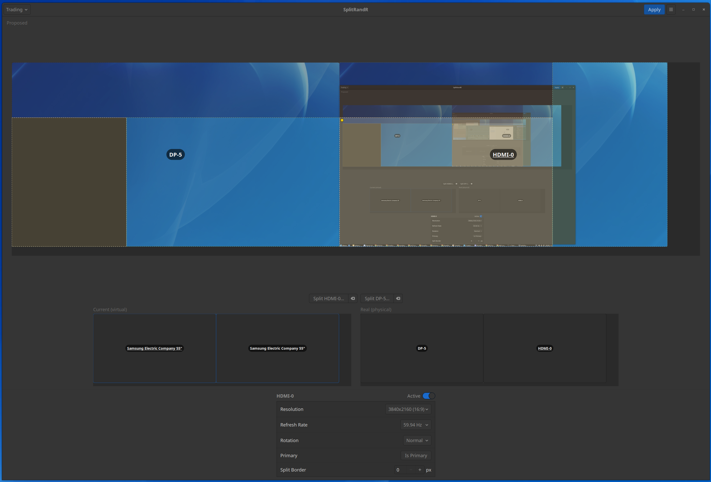
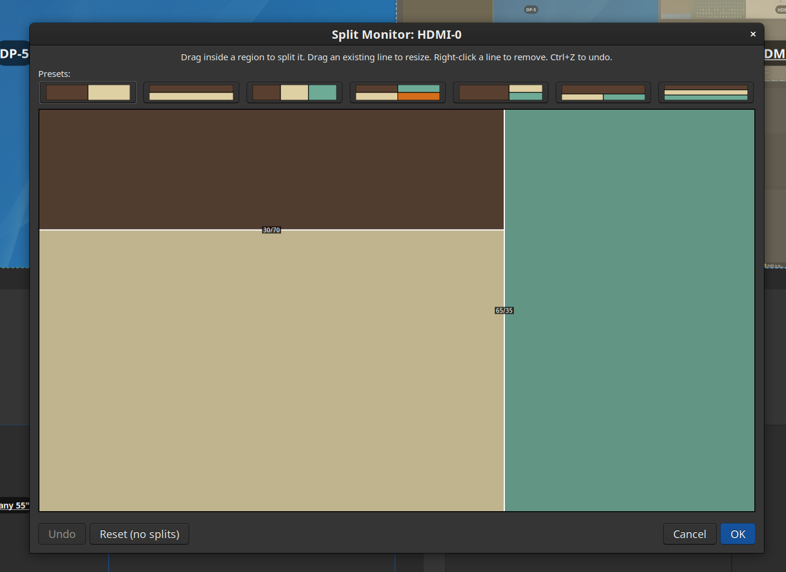

# SplitRandR

A GTK3 display layout editor for X11 that lets you split a single physical monitor into multiple virtual monitors for window tiling and maximization. Based on [ARandR](https://christian.amsuess.com/tools/arandr/).

SplitRandR is focused on **Linux Mint / Cinnamon** desktops, where the Muffin window manager ignores RandR 1.5 virtual monitors. It bundles a vendored fork of [fakexrandr](https://github.com/niclas/fakexrandr) to work around this by intercepting libXrandr calls at the LD_PRELOAD level.





**This is experimental software.** It is unlikely to work on your system without some tweaking. It was developed against a specific hardware setup (Samsung Odyssey Ark + Acer HDMI monitor on Cinnamon 6.x / Fedora) and the workarounds are tailored to that environment.

## What it does

- Provides a graphical editor for multi-monitor layouts (inherited from ARandR)
- Adds the ability to **split any output into sub-regions** using a drag-to-split interface
- Generates `xrandr --setmonitor` commands for the virtual monitor geometry
- Bundles a modified fakexrandr library that presents those splits as real outputs/CRTCs to window managers
- Handles Cinnamon-specific crash workarounds (SIGSTOP/SIGCONT during setmonitor calls)
- Writes `cinnamon-monitors.xml` so display settings (positions, modes, primary) survive Cinnamon restarts
- Supports named profiles, a login-layout autostart, and a system tray icon

## Why Cinnamon?

Most X11 window managers use the **RandR 1.2/1.3 CRTC/Output model** to determine monitor boundaries for window maximization and tiling. RandR 1.5 introduced virtual Monitors (`xrandr --setmonitor`), which exist at the X server level but are ignored by most window managers — Muffin (Cinnamon), Mutter (GNOME), KWin (KDE), and others all disregard them.

This means `xrandr --setmonitor` alone does **not** make your window manager respect virtual splits. The windows will still maximize to the full physical output.

To solve this, SplitRandR uses **fakexrandr**, an LD_PRELOAD library that intercepts `XRRGetScreenResources()` and related calls. When a window manager calls these functions, fakexrandr intercepts them and returns fake outputs and CRTCs for each split region. The WM thinks they are real monitors.

The Cinnamon focus exists because:

1. **Muffin >= 5.4.0 segfaults** when it receives RandR SetMonitor events ([muffin#532](https://github.com/linuxmint/muffin/issues/532)). SplitRandR includes a `CinnamonSetMonitorGuard` that SIGSTOPs Cinnamon during `--setmonitor` calls and disables the `csd-xrandr` settings daemon plugin to prevent it from fighting our changes.

2. **Muffin uses both libXrandr and libxcb-randr**. The fakexrandr library intercepts libXrandr calls via LD_PRELOAD, but Muffin also makes direct xcb-randr calls that bypass the interception. The vendored fakexrandr includes additional xcb-randr interceptors for `set_crtc_config`, `set_crtc_transform`, and `change_output_property` to handle this.

3. **Cinnamon's display persistence** uses `~/.config/cinnamon-monitors.xml` (mutter's monitors.xml v2 format). Muffin only applies a stored configuration when it matches the connected monitor set exactly — connector/vendor/product/serial strings byte-for-byte, disabled monitors listed in `<disabled>`, and mode rates within 0.001 Hz of `dotClock / (hTotal × vTotal)`. On any mismatch it silently falls back to a generated config that enables every connected output. SplitRandR therefore writes the file in the *shim's* view: one logicalmonitor per split leaf (leaf 0 keeps the parent connector name, later leaves are `NAME~1`…), `unknown` specs for the EDID-less fake outputs, computed-precision rates, and `<disabled>` entries for outputs you turned off — so the layout, including deliberately disabled outputs, survives restarts.

Other desktop environments have their own quirks and would need their own workarounds. The approach taken here is in principle applicable to GNOME, KDE, etc., but the crash workarounds, config file format, and xcb interception details would differ.

## How it works

### Architecture

```
SplitRandR (Python/GTK3)
├── gui.py            - Application entry point, CLI options, singleton lock
├── gui_app_*.py      - Main window: layout canvas, controls, apply flow, profiles
├── gui_screen_watcher.py - Re-applies the layout on unlock/wake/hotplug
├── widget.py         - Monitor preview/layout widget (from ARandR)
├── xrandr.py         - XRandR wrapper (+ xrandr_load/save/invoke mixins)
├── splits.py         - Binary split tree model (proportional 0.0-1.0)
├── compositor.py     - Cinnamon/GNOME abstraction (names, buses, capability flags)
├── cinnamon_compat.py - SIGSTOP/SIGCONT guard for Muffin crash
├── fakexrandr_config.py - fakexrandr.bin writer + monitors.xml writer + restarts
├── profiles.py       - Named profile management
└── tray.py           - System tray (XApp → GtkStatusIcon → AppIndicator3 fallback)

fakexrandr/ (vendored C library)
└── libXrandr.c     - LD_PRELOAD interception of libXrandr + libxcb-randr
```

### Split tree model

Splits are stored as a binary tree with proportional positions:

```
Root (V split at 60%)
├── Left leaf  (60% width)
└── Right (H split at 40%)
    ├── Top leaf (40% height of right portion)
    └── Bottom leaf
```

Each split has a direction (`H` for horizontal line, `V` for vertical line) and a proportion (0.0-1.0). This makes splits resolution-independent — they scale with the output.

### Apply flow

When you click **Apply**:

1. Every `xrandr` subprocess runs with `LD_PRELOAD` stripped from its environment, so it always operates on the real X server state even when SplitRandR itself was launched from a preloaded session
2. `xrandr --output ... --mode ... --pos ...` sets the physical output configuration
3. Inside a `CinnamonSetMonitorGuard` (SIGSTOPs Cinnamon):
   - Existing virtual monitors (`OUTPUT~N`) are deleted
   - New virtual monitors are created via `xrandr --setmonitor`
   - The fakexrandr binary config (`~/.config/fakexrandr.bin`) is written atomically (tmp file + rename — a truncate-in-place is visible to a concurrently-reading Cinnamon and crashes it)
4. `cinnamon-monitors.xml` is written in the shim's view (see above)
5. Cinnamon is restarted with `LD_PRELOAD=.../libXrandr.so.2 cinnamon --replace` only when needed: the shim is missing or stale in the WM process (checked via `/proc/PID/maps`), or this apply actually changed `fakexrandr.bin` (Muffin caches its MetaMonitor list and only rebuilds it across a restart). Applies that don't touch splits — like disabling an output — do not restart the WM
6. Auto-lock is disabled (`lock-enabled=false`) on every restart with splits, because cinnamon-screensaver's lock screen cannot render over split monitors and falls back to `cs-backup-locker`, an unrecoverable black grab
7. `xapp-sn-watcher` is restarted so AppIndicator3 tray menus pick up the new monitor geometry (its GDK caches the layout at startup)

### fakexrandr binary config format

The config file (`~/.config/fakexrandr.bin`, format version 3) is a header followed by a sequence of entries:

```
Header:
  <magic:        4 bytes>             "FXRD"
  <version:      4 bytes, uint32>     3
  <primary_name: 128 bytes, padded>   Connector that owns XRRGetOutputPrimary
                                      (leaf 0 keeps the parent name; set even
                                      with no splits, to defeat Mutter's
                                      leftmost-monitor primary default)

Entry:
  <length:       4 bytes, uint32>     Total length of payload
  <output_name:  128 bytes, padded>   e.g. "DP-5"
  <edid:         768 bytes, padded>   Hex-encoded EDID string
  <width:        4 bytes, uint32>     Output width in pixels
  <height:       4 bytes, uint32>     Output height in pixels
  <split_count:  4 bytes, uint32>     Number of leaf regions
  <border:       4 bytes, uint32>     Dead-zone border between splits, pixels
  <primary_leaf: 4 bytes, uint32>     Spatial index of the primary leaf,
                                      0xFFFFFFFF if none
  <tree_data:    variable>            Serialized binary tree

Tree node:
  'N'                                 Leaf node
  'H' + <pos: 4 bytes, uint32>       Horizontal split at pos pixels from top
       + left_tree + right_tree
  'V' + <pos: 4 bytes, uint32>       Vertical split at pos pixels from left
       + left_tree + right_tree
```

### fakexrandr interception

The vendored fakexrandr intercepts at two levels:

**libXrandr level** (standard LD_PRELOAD):
- `XRRGetScreenResources` / `XRRGetScreenResourcesCurrent` — augmented with fake outputs, CRTCs, and modes
- `XRRGetMonitors` — synthesizes one RandR monitor per split leaf and filters out the server-side `--setmonitor` virtual monitors, so a preloaded client sees each split exactly once (leaf 0 is folded into the parent connector name)
- `XRRGetOutputInfo` — returns fake output info for split regions
- `XRRGetCrtcInfo` — returns fake CRTC info with correct geometry
- `XRRSetCrtcConfig` — no-op for fake CRTCs (updates internal state)
- `XRRGetOutputPrimary` — reports the configured primary leaf
- `XRRGetOutputProperty` — returns empty for fake outputs (no EDID)
- `XSetErrorHandler` — intercepts to suppress BadRROutput errors

`XRRGetMonitors` also guarantees `noutput >= 1` on every monitor it returns, backfilling output-less setmonitor VMs with their parent output: GTK3's `init_randr15` reads `outputs[0]` without checking `noutput` (gtk 3.24, `gdk/x11/gdkscreen-x11.c`), so a raw output-less VM gets included or dropped depending on heap garbage — dropped regions make GTK apps place popup menus on the wrong screen.

**libxcb-randr level** (additional interception for Muffin, which bypasses libXrandr for these):
- `xcb_randr_set_crtc_config` (+ `_checked`, `_reply`) — no-op for fake CRTCs; also **blocks disables of real CRTCs while splits are active** (Mutter's initial config apply would otherwise turn off the parent CRTC that backs the fakes)
- `xcb_randr_set_crtc_transform` — no-op for fake CRTCs
- `xcb_randr_change_output_property` — no-op for fake outputs

Fake XIDs use the upper bits (`XID_SPLIT_MASK = 0x7FE00000`) to distinguish them from real XIDs.

### Lock screen (cinnamon-screensaver)

fakexrandr only affects processes it is `LD_PRELOAD`ed into. Muffin gets it
via `restart_cinnamon_with_fakexrandr`, but **cinnamon-screensaver** is D-Bus
activated from `/usr/share/dbus-1/services/org.cinnamon.ScreenSaver.service`
with a bare `Exec=/usr/bin/cinnamon-screensaver` and no preload. Left alone,
the lock screen computes its geometry from the *real, unsplit* outputs while
muffin uses the split ones. On a display hotplug the two disagree, the
screensaver logs `Screen rect ... and monitor rects ... DO NOT add up`, and it
can fall back to `cs-backup-locker` — a bare black grab with **no unlock UI**,
i.e. an unrecoverable lock.

`fakexrandr_config.write_screensaver_dbus_override()` fixes this by writing a
user-level D-Bus service override to
`~/.local/share/dbus-1/services/org.cinnamon.ScreenSaver.service` (files under
`$XDG_DATA_HOME` shadow the system service file for the session bus). The
override injects the **same** `LD_PRELOAD` path muffin uses — resolved once via
`_find_fakexrandr_lib()`, so dev-tree and RPM installs stay consistent — and
`cs-backup-locker` inherits it as a child. It is generated at runtime rather
than shipped as a static file precisely because that `.so` path differs
between a source checkout and an installed package.

It is written idempotently from two places: `restart_cinnamon_with_fakexrandr`
(so the lock screen tracks muffin whenever the layout is applied) and the
`--watch` startup (so every session has it). When the file changes, the
session bus is asked to `ReloadConfig` and any running screensaver is dropped
so the next on-demand activation carries the preload — this does not lock the
screen. Delete the file and reload dbus to restore the stock screensaver.

The override turned out to be necessary but not sufficient: even with the
screensaver seeing the same monitor set as muffin, triggering a lock on a
split layout still spawned `cs-backup-locker`. Since 0.6.0,
`disable_screensaver_lock()` therefore also sets `lock-enabled=false`
(plus `idle-delay=0`, `lock-delay=0`) on every split apply. Re-enable with
`gsettings reset` on those keys once the upstream lock-screen rendering bug
is fixed — but expect the backup-locker trap until then.

### Session-wide preload

The GTK3 `outputs[0]` bug above can only be fully avoided by making sure
apps load the shim, whose `XRRGetMonitors` always returns GTK-safe
records. Applying a layout **with splits** therefore installs a
session-wide `LD_PRELOAD` at three injection points, and applying a
layout **without splits** withdraws all three:

- a marked block in `~/.bash_profile` (the lightdm session chain runs a
  login bash; the block is gated to local `:N` displays so ssh logins
  are unaffected) — covers everything Cinnamon and the session autostart
  spawn at the next login;
- `~/.config/environment.d/90-splitrandr.conf` — covers systemd user
  services;
- `dbus-update-activation-environment --systemd` — covers D-Bus and
  systemd activation in the *current* session immediately.

Already-running apps keep their environment; restart them (or log out
and back in) to pick up the preload. The shim passes through untouched
when `~/.config/fakexrandr.bin` is absent, and the dynamic linker
ignores `LD_PRELOAD` for setuid binaries. 32-bit programs print a
one-line "wrong ELF class" warning on stderr since only a 64-bit shim
is shipped; the warning is harmless.

### Running on GNOME (Xorg)

Muffin is a fork of Mutter, so the same machinery drives GNOME with only names
and paths swapped. `compositor.py` centralizes that: it detects the desktop
(`XDG_CURRENT_DESKTOP`, falling back to sniffing the running shell, defaulting
to Cinnamon) and exposes the per-DE values every other module consults —

| | Cinnamon | GNOME |
|---|---|---|
| shell / restart | `cinnamon --replace` | `gnome-shell --replace` |
| DisplayConfig bus | `org.cinnamon.Muffin.DisplayConfig` | `org.gnome.Mutter.DisplayConfig` |
| persisted layout | `~/.config/cinnamon-monitors.xml` | `~/.config/monitors.xml` |
| readiness probe | `org.Cinnamon.Eval` | `org.gnome.Shell` Peer.Ping (Eval is disabled) |
| settings-daemon xrandr fight | disable the gsd plugin | none (folded into Mutter) |
| setmonitor SIGSTOP guard (muffin#532) | **yes** | no |
| separate screensaver override | **yes** | no (lock is inside gnome-shell) |
| panel pinning | yes | no |

The last four are capability flags that are False on GNOME, so those
Cinnamon-only workarounds become no-ops. The DE-neutral pieces — the
`fakexrandr.bin` format, the split tree, the xcb-randr interception, and
unlock/wake re-apply — are unchanged.

**Hard constraint: Xorg only.** fakexrandr is an `LD_PRELOAD` shim over
libXrandr/libxcb-randr; a Wayland compositor never makes those calls, so
splitrandr cannot work under Wayland at all. GNOME defaults to Wayland — you
must pick **"GNOME on Xorg"** at the login screen. The watcher logs a warning
(`compositor.session_is_wayland`) when it detects a Wayland session.

> GNOME support is wired but **untested on real GNOME hardware** — it was
> developed and verified on Cinnamon. The Mutter-specific unknowns (does
> `--setmonitor` need the SIGSTOP guard? does its mode-list cache go stale the
> same way?) can only be settled by running it on GNOME-on-Xorg.

## Design issues and limitations

### It probably won't work on your system without tweaking

This was built for a specific setup. Things that will likely need adjustment:

- **Different window managers**: The Cinnamon SIGSTOP workaround, monitors.xml writing, and xcb interception are all Cinnamon/Muffin-specific. GNOME uses `~/.config/monitors.xml` (different format). KDE uses its own config. Other WMs may not need crash workarounds at all.

- **Different GPU drivers**: The NVIDIA proprietary driver has its own RandR quirks. AMD/Intel/nouveau may behave differently. The XID split mask and output/CRTC numbering depend on driver behavior.

- **LD_PRELOAD persistence**: fakexrandr must be loaded into the WM process. On Wayland this approach doesn't work at all. On X11, the WM must be started with `LD_PRELOAD` — which means restarting it. Session managers may fight this.

- **Race conditions**: There's inherent raciness between writing the fakexrandr config, restarting Cinnamon, and re-applying xrandr settings. The timing (`sleep` calls) is tuned for one system.

### The xcb bypass problem

Muffin links directly against `libxcb-randr.so.0` in addition to `libXrandr.so`. xcb calls bypass the LD_PRELOAD interception. The vendored fakexrandr includes xcb interceptors for the critical functions, but not all xcb-randr functions are intercepted. This means some operations (like `xcb_randr_get_screen_resources`) still go through to the real X server and return unaugmented results. This can cause inconsistencies where Muffin sees different state depending on which code path it takes.

### CRTCs and output properties

Fake outputs return empty EDID and no output properties. This means Muffin identifies them as "unknown" vendor/product/serial in its monitor matching. The `cinnamon-monitors.xml` writer accounts for this by using "unknown" for fake output entries.

### Muffin crash workaround fragility

The SIGSTOP/SIGCONT approach is inherently fragile. If SplitRandR crashes or is killed between SIGSTOP and SIGCONT, Cinnamon will remain frozen and you'll need to manually `kill -CONT $(pgrep -x cinnamon)`. The guard tries to handle this via `__exit__` but can't protect against `SIGKILL`.

### Autostart complexity

The autostart script needs to:
1. Apply xrandr configuration
2. Create virtual monitors (with Cinnamon frozen)
3. Write fakexrandr config

But at login, Cinnamon may not be fully started yet. The autostart `.desktop` entry runs the saved shell script, which includes the Cinnamon SIGSTOP/SIGCONT wrapper inline. This mostly works but timing-sensitive.

## Installing (Fedora)

Packages are published on COPR for the currently supported Fedora releases:

```sh
sudo dnf copr enable reversejames/splitrandr
sudo dnf install splitrandr
```

The RPM ships the prebuilt fakexrandr library at `/usr/local/lib64/libXrandr.so.2` (deliberately outside the linker search path, so it never shadows the real libXrandr for anything that isn't explicitly preloaded).

## Requirements

- Python 3
- GTK 3 (via PyGObject)
- X11 with XRandR 1.2+
- GCC, libxrandr-dev, libx11-dev, libxcb-randr0-dev (for building fakexrandr)
- Cinnamon desktop (for the full integration; basic xrandr features work elsewhere)
- XApp (recommended, for correct tray icon menu positioning on Cinnamon)

## Building

```sh
# Build the fakexrandr library
cd fakexrandr
make
cd ..

# Run directly
python -m splitrandr

# Or use the bin script
./bin/splitrandr
```

## Usage

1. Launch SplitRandR
2. Drag monitors in the *Proposed* pane to position them; select one to edit it
3. Use the per-monitor list below the canvas to set resolution, refresh rate, rotation, primary, and split border
4. Click the **Split \<output\>…** button for a monitor to open the split editor — pick a preset or drag inside a region to split it, drag a line to resize, right-click a line to remove it
5. Click **Apply** in the header bar to apply the configuration
6. Use **Apply & Set Login Layout** in the hamburger menu to also save the layout for login autostart

### CLI options

```
splitrandr --apply [file]     # Apply a saved layout JSON (default:
                              # ~/.config/splitrandr/layout.json) and exit;
                              # this is what the login autostart runs
splitrandr --watch            # Headless watcher: re-applies the active
                              # profile on unlock, wake, and monitor hotplug
splitrandr --regenerate       # Regenerate the autostart layout and active
                              # profile from the current X state
splitrandr --update-configs   # Rewrite fakexrandr.bin and
                              # cinnamon-monitors.xml from the current X state
```

`--regenerate` is useful after updating SplitRandR so the saved layout picks up new apply-flow features without re-doing your layout.

## Credits

- Based on [ARandR](https://christian.amsuess.com/tools/arandr/) by chrysn
- Uses a vendored fork of [fakexrandr](https://github.com/niclas/fakexrandr) by Phillip Berndt / niclas
- Cinnamon crash workaround based on [muffin#532](https://github.com/linuxmint/muffin/issues/532) analysis

## License

GPLv3 — see `splitrandr/data/gpl-3.txt`
